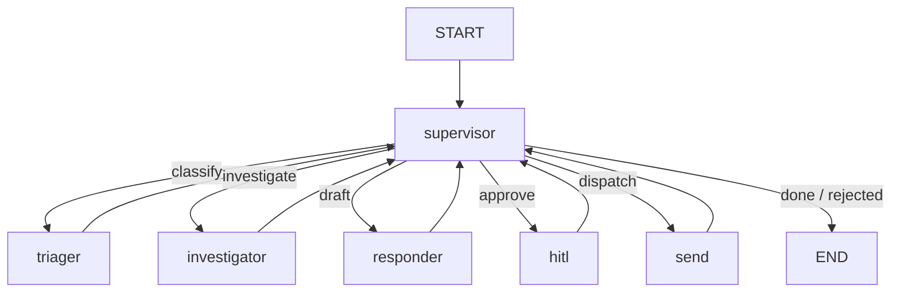

# Resonance Ticket Triage Agent (LangGraph Supervisor + HITL)

**Multi-agent support ticket triage system** for The Resonance Technologies Agentic AI (Project 2).

Incoming tickets are classified, investigated with domain tools, drafted into a customer reply (using three memory layers), paused for **human-in-the-loop** approval, then sent (mock outbound). P1 incidents also notify Slack (`#incidents`).

- **Orchestration:** LangGraph **supervisor loop** — workers never route to each other  
- **Workers:** `triager` → `investigator` → `responder` → `hitl` → `send`  
- **Memory:** procedural (versioned prompts) · episodic (similar past cases) · semantic (per-user Store)  
- **Models:** AWS Bedrock (`gpt-oss-120b`) or Google Vertex (`gemini-2.5-pro`); `fake` for offline demos  
- **UI:** FastAPI approval console on **port 8002**  
- **Deploy:** Bedrock AgentCore **and** Vertex AI Agent Engine  
- **Quality / safety:** LangSmith evals + 20-attack injection suite (pass ≥ 95%)

Sibling Project 1 (research assistant) lives in [`../RAIRA-AI-Research-Assistant/`](../RAIRA-AI-Research-Assistant/) and typically shares `.env`.  
Full as-built planning record: [`AS_BUILT.md`](AS_BUILT.md).

---

## Architecture

```
Ticket → FastAPI (/ingest | /ingest/demo)
            → LangGraph (SqliteSaver locally)
                 START → supervisor
                           ├─ triager        classify category + severity
                           ├─ investigator   logs / metrics / runbooks / history (≤ 8 tools)
                           ├─ responder      draft + escalate/send (3 memory layers)
                           ├─ hitl           interrupt → approve | edit | reject
                           ├─ send           mock email log (+ Slack if P1)
                           └─ END
            ← Approval UI polls /pending → POST /approve/{thread_id}
```



**Routing (pure logic, no LLM):** missing classification → triager; empty findings → investigator; no draft → responder; `pending` → HITL; approved/edited → send; guardrail/`rejected` → END.

**Security:** hard-block prompt-injection patterns (and optional Bedrock Guardrail) refuse before triage; softer risk/PII cases escalate through the responder + HITL.

See [`AS_BUILT.md`](AS_BUILT.md) for locked decisions, memory details, and verification checklist.

---

## Prerequisites

- **Python** 3.11 or 3.12 (`uv` recommended)
- Shared **`.env`** from `../RAIRA-AI-Research-Assistant/.env` (or a local `.env`)
- Optional: Docker Postgres on `:5433` for Store / episodic pgvector
- Cloud creds as needed: AWS (Bedrock / AgentCore), GCP (Vertex / Agent Engine)
- Optional: `LANGSMITH_API_KEY`, `SLACK_BOT_TOKEN`, `BEDROCK_KB_ID`, `BEDROCK_GUARDRAIL_ID`

---

## Quick start

### 1. Environment

```bash
cd RTTA-AI-Multi-Agent-Ticket-Triage
uv sync
# Env loads from ./ .env or ../RAIRA-AI-Research-Assistant/.env (override=True)
```

Offline dry-run:

```powershell
$env:RTTA_MODEL='fake'
```

### 2. CLI sample ticket

```bash
uv run python -m app.graph
# Streams supervisor → workers for SAMPLE_TICKET (TKT-1001 MFA loop)
```

### 3. Approval UI

```bash
uv run python -m app.main
```

Open **http://127.0.0.1:8002**.

| Action | How |
|--------|-----|
| Demo ticket | Click **Demo** or `POST /ingest/demo` |
| Custom ticket | `POST /ingest` with JSON body |
| Approve / edit / reject | Pending card → `/approve/{thread_id}` |

```bash
curl -X POST http://127.0.0.1:8002/ingest/demo
curl http://127.0.0.1:8002/pending
```

### 4. Evals & security

```bash
uv run python evals/triager_eval.py
uv run python evals/investigator_eval.py
uv run python evals/responder_eval.py
uv run python evals/e2e_eval.py
uv run python evals/run_all.py

uv run python security/injection_eval.py   # expect ≥ 95%
```

### 5. Ops dashboard & prompt refine

```bash
uv run streamlit run app/ops/dashboard.py
uv run python -m app.cron.refine_responder_prompt --domain support
# Prints a proposed v+1 procedural prompt to stdout — does NOT auto-apply
```

### 6. Deploy (optional)

```bash
bash deploy/deploy_agentcore.sh
# AGENT_NAME default: rtta_ticket_triage

bash deploy/deploy_vertex_engine.sh
# Writes VERTEX_ENGINE_RESOURCE_NAME to .env.deployed

ALERT_EMAIL=you@example.com bash scripts/setup_billing_alerts.sh
```

---

## API

| Method | Path | Description |
|--------|------|-------------|
| `GET` | `/` | Approval UI |
| `POST` | `/ingest` | `{ "ticket": {...}, "domain": "support" }` → `{ thread_id }` |
| `POST` | `/ingest/demo` | Built-in MFA-loop sample (`TKT-1001`) |
| `GET` | `/pending` | Threads waiting on HITL (draft + classification + findings) |
| `GET` | `/threads` | In-memory thread status map |
| `POST` | `/approve/{thread_id}` | `{ "action": "approve\|edit\|reject", "edited_body"? }` |

Default bind: `HOST=127.0.0.1`, `PORT=8002`.

---

## Example tickets (demo / screenshots)

| ID | Scenario | Notes |
|----|----------|--------|
| **TKT-1001** | MFA login loop | `/ingest/demo` — happy path to HITL |
| **TKT-E01** | Login / MFA | Golden: send |
| **TKT-E02** | Refund / billing | Golden: **escalate** |
| **TKT-E05** | Suspicious login | Golden: **P1 escalate** (+ Slack on send) |
| **TKT-E03 / E04 / E06** | Bug / feature / Slack webhook | Golden coverage |

Full golden set: `evals/golden.jsonl`.  
Injection attacks: `security/attacks.jsonl` (e.g. `jailbreak_dan` → blocked; `refund_by_eod` → escalated).

---

## Project layout

```
RTTA-AI-Multi-Agent-Ticket-Triage/
├── app/
│   ├── main.py                 # FastAPI approval UI (:8002)
│   ├── graph.py                # build_graph / build_graph_with_backends
│   ├── state.py / llm.py / guardrails.py / hitl.py
│   ├── agents/                 # supervisor, triager, investigator, responder, hitl, send
│   ├── memory/                 # semantic, episodic, procedural
│   ├── tools/                  # query_*, search_runbooks, send_response, notify_slack
│   ├── ui/                     # approval.html
│   ├── ops/dashboard.py        # Streamlit ops metrics
│   └── cron/refine_responder_prompt.py
├── evals/                      # golden sets + component / e2e evals
├── security/                   # attacks.jsonl + injection_eval.py
├── deploy/                     # AgentCore + Vertex Engine
├── data/
│   ├── support/                # taxonomy, mocks, runbooks, historical tickets
│   ├── prompts/                # responder_* procedural prompts
│   ├── hitl_outcomes.jsonl
│   ├── sent_responses.log
│   └── slack_notifications.log
├── scripts/setup_billing_alerts.sh
├── agentcore_entrypoint.py
├── checkpoints.sqlite
├── pyproject.toml
├── AS_BUILT.md
└── README.md                   # this file
```

---

## Configuration (essentials)

| Variable | Role |
|----------|------|
| `RTTA_MODEL` | Chat model (Bedrock default, Vertex, or `fake`) |
| `RTTA_EMBEDDINGS` | Embeddings |
| `RTTA_MEMORY` | `memory` (default) or `postgres` |
| `RTTA_RUNBOOKS` | `auto` \| `file` \| `bedrock` |
| `POSTGRES_DSN` | Store / episodic / AgentCore checkpointer |
| `HOST` / `PORT` | Default `127.0.0.1:8002` |
| `BEDROCK_GUARDRAIL_ID` | Optional Bedrock Guardrail |
| `BEDROCK_KB_ID` | Optional Knowledge Base for runbooks |
| `SLACK_BOT_TOKEN` | Live Slack; else mock file log |
| `LANGSMITH_*` | Eval / trace upload |
| `GCP_PROJECT` / `GCP_BUCKET` | Vertex Agent Engine deploy |
| `ALERT_EMAIL` | Billing budget alerts |

---

## Deliverables

1. **System / as-built design** — [`AS_BUILT.md`](AS_BUILT.md)  
2. **Multi-agent implementation** — supervisor + five workers, three memory layers, mock tools  
3. **HITL demo** — approval UI on `:8002` with approve / edit / reject  
4. **Evals & security** — LangSmith component/e2e evals + injection suite  
5. **Ops stretch** — Streamlit dashboard, Slack P1 notify, prompt-refine cron, dual cloud deploy  

---

## Out of scope

Real Zendesk/ServiceNow/PagerDuty connectors, live log/metrics APIs, production SMTP, Vertex Model Armor in-app wiring, Terraform/Helm, and auto-applying procedural prompt upgrades without instructor review — see [`AS_BUILT.md`](AS_BUILT.md).

---

## Related

| Resource | Location |
|----------|----------|
| As-built planning | [`AS_BUILT.md`](AS_BUILT.md) |
| Day prompts | [`../project2-prompts.md`](../project2-prompts.md) |
| Cursor rules | [`../RAIRA-AI-Research-Assistant/.cursor/rules/project2-ticket-triage.mdc`](../RAIRA-AI-Research-Assistant/.cursor/rules/project2-ticket-triage.mdc) |
| Shared env | [`../RAIRA-AI-Research-Assistant/.env`](../RAIRA-AI-Research-Assistant/.env) |
| Project 1 (Research Assistant) | [`../RAIRA-AI-Research-Assistant/`](../RAIRA-AI-Research-Assistant/) |
